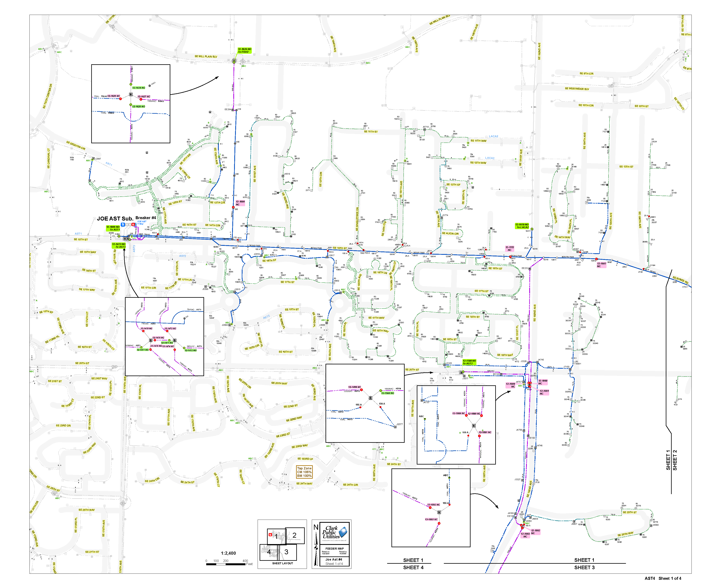
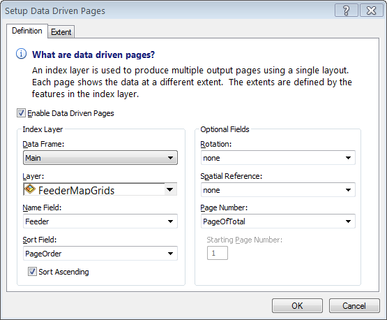
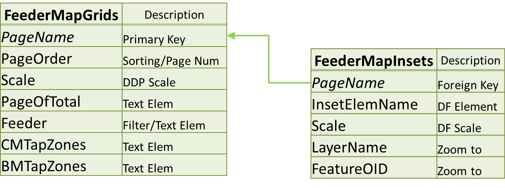
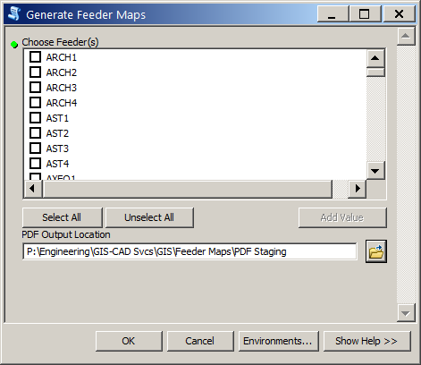
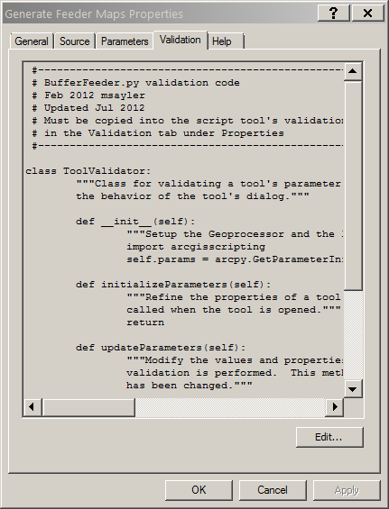

#Follow along: http://mattsayler.github.io/Automating_Feeder_Maps_Presentation

(Hyperlinks look like [this](#))

#_Automating_ Feeder Maps Using _Data Driven Pages_ and _Arcpy_

#OR

Matt Sayler
_Clark Public Utilities_

#Obligatory _Stats_ Slide

* Public Utility District
* Electric and Water
* ~185,000 Electric Meters
* ~400 Employees

#System

* ArcGIS 10.0 SP4
* ArcFM 10.0 SP2

#Brief _History_ of Feeder Maps at Clark

_Dedicated_ full-time employee

~450 pages of _individually_ customized MXD files

* Custom _layouts_ w/_selection-set layers_
* Custom _jpegs_ for inset details (_~300_ images)

Custom _'best-fit'_ grid layout for _each_ feeder

#Pros:

Highly _specific_ symbology

Covers _edge-case_ maps very well

Fits _Dispatch's_ specific _needs_ very well

#Cons:

Management _nightmare_ for GIS Dept.

_Turn-around_ time commonly measured in _days_ per page

_Complex_ process to _add_ new pages

#Then...

Dedicated employee _retires_

Position _left vacant_

_Same_ work, _fewer_ resources

#Option One

Continue with the _existing_ process

(_GIS staff_ mutinies)

#Option Two

Go to a _standardized_ county-wide map grid w/_simplified_ symbology

(_Dispatch staff_ mutinies)

#Option Three

Standarize map _elements_ and leverage the new _Data Driven Pages_ functionality

(Some _initial_ grumbling, but _no mutinies_!)

#Winner

#_What_ are [Data Driven Pages](http://resources.arcgis.com/en/help/main/10.2/index.html#//00s90000003m000000)?

_Tools_ for creating _mapbooks_ using _feature classes_ (basically)

Like

_Grid_ polygons

Existing _Point_ feature classes

#_What_ is [arcpy](http://resources.arcgis.com/en/help/main/10.2/index.html#//000v000000v7000000)?

Esri [python](https://www.python.org/) library for _geoprocessing_ and _other_ tasks

#Project Goals

Retain _80-90%_ of original maps' features

Remain _flexible_

Greatly _reduce_ production time

#Example _New_ Feeder Map

#_How_ does it work?

Feature class attributes _drive_ dynamic content

#Pros:

#Cons:

#Another _Cool_ Feature

_Dynamic_ feeder picklist!

_Unique value list_ derived from a feature class

Achieved through modifying the script's _validation_ code

#Questions?

_Thank you!_
[@mattsayler](https://www.twitter.com/mattsayler)
[github.com/mattsayler](https://www.github.com/mattsayler)
Presentation Powered by [@calvinmetcalf's _medium_](https://github.com/calvinmetcalf/medium)
